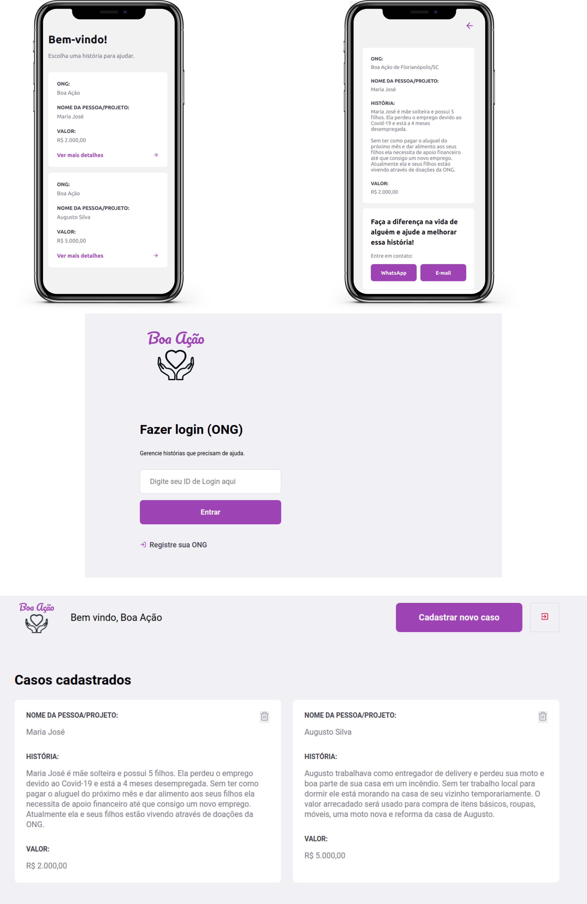

<h1  align="center">

</h1>

 

  

  

## Tecnologias

  

Esse projeto foi desenvolvido com as seguintes tecnologias:

  

- [Node.js](https://nodejs.org/en/)

- [React](https://reactjs.org)

- [React Native](https://facebook.github.io/react-native/)

- [Expo](https://expo.io/)

  

## Projeto

  

O Boa Ação é um projeto que visa conectar pessoas que desejam fazer contribuições monetárias ou outro tipo de ajuda a ONG's (Organizações Não Governamentais) que precisam de apoio.

Dentro do projeto atual foi criada uma ONG ficticia que ajuda pessoas em vulnerabilidade social.

Foram criadas 2 personas que estão em vulnerabilidade social dentro do projeto: **Augusto e Maria**.  

## Como Rodar o Projeto

  - Necessário **Node.js** instalado.  Versão recomendada: 12.8.x

### Backend

- Dentro do terminal, acesse a pasta **backend**
- **cd backend/**
- Rode **npm install** para instalar as dependências.
- Rode **npm start** para iniciar a API. Deixe a API rodando enquanto executa as demais aplicações.

### Mobile

- Em outro terminal, acesse a pasta **mobile**
- **cd mobile/**
- Rode **npm install --global expo-cli** para instalar o [Expo](https://expo.io/) localmente.
- Rode **npm install** para instalar as dependências.

#### Executando o App no seu Aplicativo:

- Para Rodar o projeto dentro do seu aplicativo, será necessário baixar o App do **Expo** na Google Store ou Apple Store. 
	- ANDROID: Digite o comando **npm  android** para iniciar o Expo no Android. Espere o QRCode aparecer e escaneie ele pelo seu aplicativo Expo.
	- IOS: Digite o comando **npm  ios** para iniciar o Expo no seu iPhone. Espere o QRCode aparecer e escaneie ele pelo seu aplicativo Expo.
	- WEB: Para iniciar o app na web, rode o comando **npm web**

- **IMPORTANTE**: Alterar no arquivo **mobile/src/services/api.js** e substitua **localhost** para o IP da sua máquina ou a máquina que está rodando o Backend caso queira rodar no seu aplicativo.  

### Frontend

- Dentro de outro terminal, acesse a pasta **frontend** 
- **cd frontend/**
- Rode **npm install** para instalar as dependências.
- Rode **npm start** para rodar a página Web que irá ser feito o gerenciamento das pessoas que precisam de ajuda.

- Código de login ONG ficticia: **79bee084**
